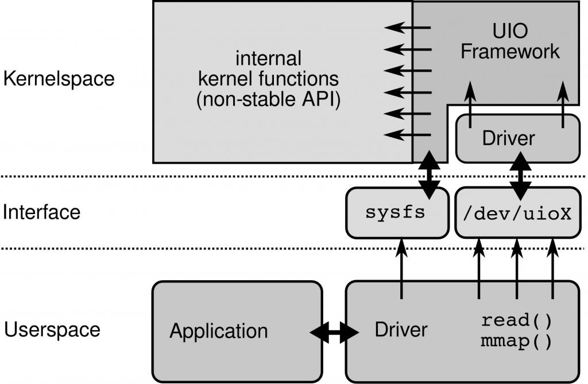
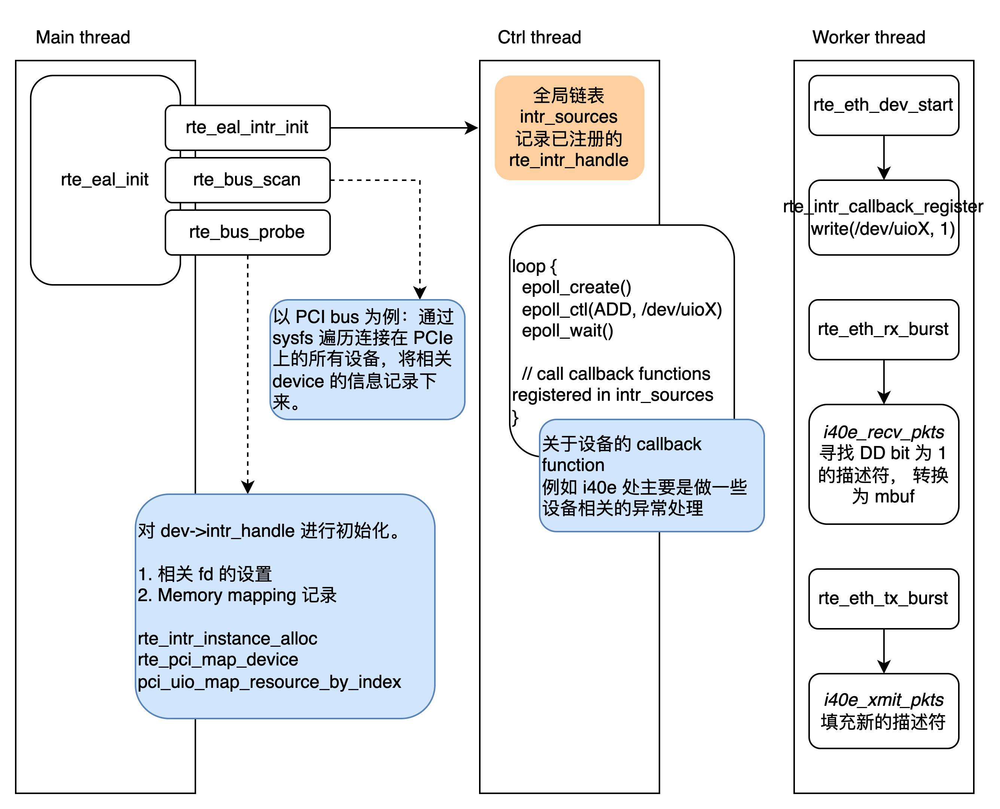

# 传统网络 IO 性能瓶颈与 DPDK

传统的 Linux 网络报文收发以中断的形式通知操作系统网络包的到来，随着网络带宽的发展，性能瓶颈逐渐从网卡转移到了内核，这种中断通知的方式带来较大的开销。以一次收包为例，大概经过以下几个过程：

1. 驱动填写 rx ring buffer，可以视作是一片由描述符构成的环形队列，一个描述符表示一个待接收的报文（驱动已经分配好内存，等待网卡填充数据），其中包括即将由网卡填充的 DMA 地址。
2. 报文到达网卡缓冲区。
3. 网卡读取接收描述符，获得内存缓冲区地址，通过 DMA 把数据转移到内核态内存，通过硬中断通知 CPU。
4. 网卡驱动程序响应硬中断，发出软中断。
5. ksoftirq 内核线程处理软中断，调用网卡驱动注册的 poll 函数开始收包。
6. 内核解析网络协议栈，将处理后的数据放入 socket 接收队列中。
7. 内核唤醒用户进程。

{: .box-note}
**Notes:**\\
硬中断：硬件产生，发送电信号至中断控制器。\\
软中断：中断指令产生。\\
Bottom-half processing：对于一个实时系统，应快速处理完中断，不能过长地占用 CPU。然后有的中断处理时间较长，Linux 将此类中断处理分为两部分。前一部分即 `request_irq` 注册的硬中断处理程序，它占时较短，并一般通过发起一个软中断来将后半部分处理滞后进行。


其低效之处主要在于：

- 硬中断处理时间较长，大概在 100 us 左右。
- 数据在内核态和用户态之间进行拷贝，浪费 CPU 资源。
- 内核工作在多核上，锁总线带来开销。
- 频繁的中断上下文切换带来的 cache miss。

DPDK (Data Plane Development Tool) 是一种通过内核旁路来提高报文处理效率的开发工具，它主要通过以下手段避免上述问题：

- 以主动轮询代替被动接收硬中断。
- 用户态利用 mmap 读写报文，省去内存拷贝的开销。

本文主要介绍 PMD (Poll Mode Driver) 模块实现内核旁路的过程。

# UIO

传统的设备驱动程序运行在内核态，UIO (Userspace IO) 是 Linux 提供的一款供用户态驱动框架。相比于传统的驱动程序，UIO 仅需安装一个处理硬中断的内核模块，其主要逻辑运行在用户态，通过 read 系统调用感知中断，通过 mmap 系统调用读取设备内存。



## UIO 设备的注册

通过 `int uio_register_device(struct device *parent, struct uio_info *info)` 将一个设备注册为 UIO 设备，该函数需要两个参数，`parent` 指向一个真实的设备，第二个参数指向一个 `uio_info` 结构体。

```c
struct uio_info {
	char			*name;
	char			*version;
	struct uio_mem		mem[MAX_UIO_MAPS];
	long			irq;
	unsigned long		irq_flags;
	void			*priv;
	irqreturn_t (*handler)(int irq, struct uio_info *dev_info);
	int (*mmap)(struct uio_info *info, struct vm_area_struct *vma);
	int (*open)(struct uio_info *info, struct inode *inode);
	int (*release)(struct uio_info *info, struct inode *inode);
	/* Internal stuff omitted */
};
```

其中包括需要注册的 4 个函数。`handler` 即硬中断处理函数，一般来说，它负责告知中断控制器“该中断已经处理完了”，而不进行其他的处理，实际上达到了屏蔽中断的效果。其他三个 `mmap`、`open`、`release` 通过文件接口与用户态驱动进行交互，可以选择在此处设置代替 kernel built-in 函数。

## UIO 设备的控制与读写

注册一个 UIO 设备后，会有一个形如 `/dev/uio0` 的文件表示该设备；同时通过 sysfs 下的文件来传达一些设备的状态。

驱动程序主要需要做的两件事是处理中断、与上层的应用程序收发数据等等，而 UIO 设备通过一些文件来完成这些操作，其主要通过 `read` 来阻塞感知中断，通过 `mmap` 读取设备内存，通过 `write` 向 UIO 文件写 0 或 1 来禁用或使能中断。

### dev 文件

路径为 `/dev/uioX`，X 表示第几个 UIO 设备。

- `read` 的一个参数 `nbytes` 表示从 fd 读取的字节数，此处必须是 4，读出的一个 int 表示拦截的中断数量。
- `write` 向 fd 写入 4 字节，写入 1 表示 enable 中断，写入 0 表示 disable 中断。
- `mmap` 用于将文件从偏移开始的一部分数据与进程地址空间建立映射，此处可以建立用户进程地址到 `/dev/uioX` 的映射以读取设备内存，其中一个设备可以建立多个映射区域，而 offset 这个参数则是映射区域的编号 N 乘以 page size。

### sysfs 文件

一些相关的 attribute variables 则存在 sysfs 下的文件中（实则为软链接）。

- `/sys/class/uio/uioX/` 下 name, version, event 等文件记录了设备的名称、版本以及距离上次询问的中断数量。
- `/sys/class/uio/uioX/maps/` 下记录了每个被 mmap 映射的内存区域的标识名称、地址、长度、偏移（传进 `mmap` 的 `/dev/uioX` 的文件偏移量）。
- `/sys/class/uio/uioX/portio` 下记录了针对 X86 ioports 的内存映射相关信息。

# PMD 原理

PMD 即 Poll Mode Driver，一种在用户态基于轮询的驱动程序。这部分主要从 DPDK 的代码入手，了解如何利用 UIO 完成用户态驱动。

应用开始运行时调用 `rte_eal_init` 初始化 DPDK 环境，在这个过程中：

- 创建一个处理设备产生的中断的线程（仍有一些中断，例如设备状态变化，需要处理）。该部分代码位于函数 `rte_eal_intr_init` 中。
- 从 bus 开始进行设备探测，将设备进行注册。该部分代码位于 `rte_bus_scan` 以及 `rte_bus_probe` 中。本文中为方便起见，以 PCI、UIO、i40e 分别作为具体的总线、用户态驱动框架、网卡进行说明。

之后，本节的第三小节将对用户态收发包的函数实现进行说明。



## UIO 设备探测

对 UIO 设备的探测和注册的代码位于 `pci_uio_alloc_resource` 这个函数中。其中，`/dev/uioX` 文件被打开，其 fd 被保存在 `rte_intr_handle` 这个结构体中。在设备启动时（调用 `rte_eth_dev_start`），该设备相关的中断处理函数会通过 `rte_intr_callback_register` 注册。

注册的具体过程就是：将设备对应的 `rte_intr_handle` 结构体放进一个全局的链表 `intr_sources` 中。

```c
**struct rte_intr_handle {
	RTE_STD_C11
	union {
		struct {
			int dev_fd; /**< VFIO/UIO cfg device file descriptor */
			int fd;	/**< interrupt event file descriptor */
		};
		void *windows_handle; /**< device driver handle */
	};
	uint32_t alloc_flags;	/**< flags passed at allocation */
	enum rte_intr_handle_type type;  /**< handle type */
	uint32_t max_intr;             /**< max interrupt requested */
	uint32_t nb_efd;               /**< number of available efd(event fd) */
	uint8_t efd_counter_size;      /**< size of efd counter, used for vdev */
	uint16_t nb_intr;
		/**< Max vector count, default RTE_MAX_RXTX_INTR_VEC_ID */
	int *efds;  /**< intr vectors/efds mapping */
	struct rte_epoll_event *elist; /**< intr vector epoll event */
	uint16_t vec_list_size;
	int *intr_vec;                 /**< intr vector number array */
};**
```

## 中断处理线程

在 DPDK 应用启动时，创建了一个 control thread 用于中断处理，具体可以见 `rte_eal_intr_init`，这个线程主要的执行逻辑位于 `eal_intr_thread_main`，它主要通过 epoll 去处理感兴趣的中断并调用对应的回调函数。

以下主要看了看这个线程在干什么，以 linux 版本的为例，伪代码如下。

```c
eal_intr_thread_main() {
	for (;;) {
		int pfd = epoll_create(1);
		epoll_ctl(pfd, EPOLL_CTL_ADD, readfd, ...);
		
		for src in intr_sources {
			epoll_ctl(pfd, EPOLL_CTL_ADD, src->intr_handle->fd, ...);
		}

		eal_intr_handle_interrupts(pfd);
		close(pfd);
	}
}
```

`eal_intr_handle_interruptes` 则主要调用 `epoll_wait` 去等待刚刚注册的事件，其位代码如下：

```c
eal_intr_handle_interrupts(int pfd) {
	epoll_event **events;
	for (;;) {
		epoll_wait(pfd, events, ...);
		if (eal_intr_process_interrupts(events) < 0)
			return;
	}
}
```

`epoll_wait` 阻塞等待刚刚通过 `epoll_ctl` 注册的事件，当其中有事件就绪，则会被填写在 epoll_event 数组中返回，再进入 `eal_intr_process_interrupts` 去处理这些事件。

`eal_intr_process_interrupts` 通过 `read` 从这些 ready 的 fd（即 `/dev/uioX`）读出 UIO 设备的中断数，并调用针对这个 intr_source 注册的回调函数。

## 收发包函数

DPDK 中收发包的函数接口如下。

```c
static uint16_t rte_eth_rx_burst(uint16_t port_id, uint16_t queue_id, struct rte_mbuf **rx_pkts, uint16_t nb_pkts);
static uint16_t rte_eth_tx_burst(uint16_t port_id, uint16_t queue_id, struct rte_mbuf **tx_pkts, uint16_t nb_pkts);
```

这两个函数内部，会针对具体设备进行收发包函数的调用，例如在 DPDK 项目 drivers/net/i40e/i40e_rxtx.c 文件中定义了这款驱动的一些收发包的函数，名称为 `i40e_recv_pkts` 以及 `i40e_xmit_pkts`。

具体的收发包过程会直接读取网卡的描述符队列，填充新的描述符，更新 TAIL 寄存器等等。

{: .box-note}
**Notes**\\
每个网卡队列，都会拥有一个收包描述符队列和发包描述符队列。它们是位于内核内存中的环形队列，由网卡上的两个寄存器 HEAD 和 TAIL 来指示队列首尾。一般来说，HEAD 由网卡更新，TAIL 由 CPU 更新。这个队列的使用也类似生产者-消费者队列，由 CPU 提交任务，网卡取出并执行。\\
网卡寄存器更新是一次 DDIO 操作，涉及一次 PCI 事务，这也是为什么 bulk operation 是比较被鼓励的。\\
一个描述符包括网络包的地址及长度、校验、VALN 配置信息等等。收包的过程也就是，先由 CPU 分配好内存区域、填充描述符、等网卡收到包之后会将报文内容写到描述符所指示的内存区域，并将一个 DD bit 置 1。发包的过程则是，CPU 将包的信息填入描述符，网卡读取队列将包发出并将 DD bit 置1。


不确定理解正确，欢迎指正XD

# Reference

[The Userspace I/O HOWTO - The Linux Kernel documentation](https://www.kernel.org/doc/html/v4.18/driver-api/uio-howto.html)

[Linux Device Drivers, Second Edition](https://www.oreilly.com/library/view/linux-device-drivers/0596000081/ch09s05.html)

[UIO: user-space drivers](https://lwn.net/Articles/232575/)

[12. Poll Mode Driver](https://doc.dpdk.org/guides/prog_guide/poll_mode_drv.html)

[Memory in Data Plane Development Kit Part 1: General Concepts](https://www.intel.com/content/www/us/en/developer/articles/technical/memory-in-dpdk-part-1-general-concepts.html)

[Memory in DPDK Part 2: Deep Dive into IOVA](https://www.intel.com/content/www/us/en/developer/articles/technical/memory-in-dpdk-part-2-deep-dive-into-iova.html)

[DPDK之PMD原理](https://cloud.tencent.com/developer/article/1408847)