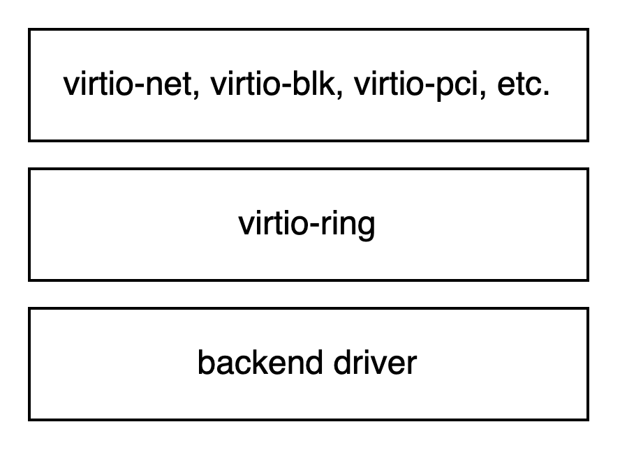
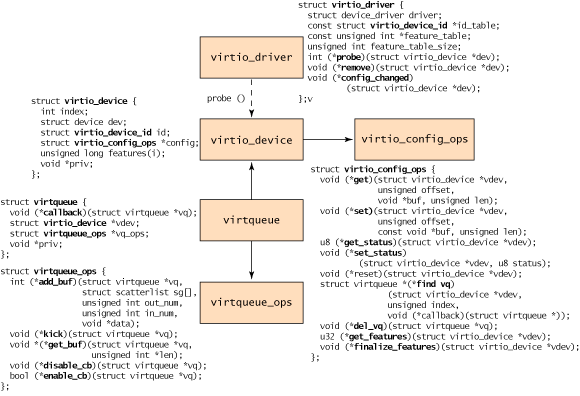

所谓 IO 虚拟化就是在物理 IO 资源之上抽象出一层 IO 资源的逻辑表示，使得上层应用对于 IO 资源的使用不受物理资源的限制。

常见的 IO 虚拟化手段有：

- **Full virtualization**，传统方法，trap 访问 IO 资源的代码，执行 hypervisor 对于设备的模拟程序。好处是运行在 Guest OS 中的应用代码不用修改、对于自己处于虚拟机中无感；坏处是性能较低，因为每次 trap 带来一次异常处理流程。
- **Paravirtualization**，也称为半虚拟化，需要 Guest OS 中的 frontend driver 将对于 IO 设备的访问转化为特定的 API 调用，与 hypervisor 中的 backend driver 协同工作。好处是性能比 full virtualization 高；坏处是需要 hypervisor 和 Guest OS 进行配合。
- **IO passthrough**，直接将设备分配给虚拟机使用。性能最好，但是需要硬件平台的支持，例如 Intel 的 VT-d。

# virtio 协议设计

如前文所言，paravirtualization 需要 Guest OS 和 hypervisor 的协同工作，virtio 就是一个协商两者的接口标准。感兴趣可以阅读《virtio: Towards a De-Facto Standard For Virtual I/O Devices》这篇论文。

## Architecture



如图所示，从上至下依次是 frontend driver、virtio-ring、backend driver。Frontend driver 位于 Guest OS 中，virtio-ring 是前后端驱动用来沟通的消息传递机制、virtqueue 的具体实现（这段内存由 Guest 和 Host 共享），backend driver 位于 hypervisor 中，为前端驱动提供类似 PCI 设备的功能。

## 接口细节

这张图中列出了 Guest OS 视角中的 virtio 设备。这部分主要从 Guest OS 的视角讲述与 virtio 设备的交互过程。至于后端驱动如何实现，也许是下篇的内容，本文中将后端视作实现了 `virtqueue_ops` 以及 `virtio_config_ops` 所规定的接口的黑盒 。

> If we want to reduce duplication in virtual device drivers, we need a decent abstraction so drivers can share code. One method is …, but more ambitious is to use common drivers and an operations structure: a series of function pointers which are handed to the generic driver to interface with any of several transport implementations.
> 



上图所示的 5 个数据结构是 virtio 比较核心的数据结构。其中 `virtio_driver` 以及 `virtio_device` 是在前端处 virtio 设备的表示，`virtio_driver` 需要前端实现，`virtqueue` 是前端与后端之间数据和控制信息交互的传输层抽象，`virtio_config_ops` 以及 `virtqueue_ops` 是设备初始化以及 IO 过程中所用到的接口，需要后端实现。

XXX: 前端需要实现 virtio_driver？

### virtio_driver

```c
struct virtio_driver {
  struct device_driver driver;
  const struct virtio_device_id *id_table;
  const unsigned int *feature_table;
  unsigned int feature_table_size;
  int (*probe)(struct virtio_device *dev);
  void (*scan)(struct virtio_device *dev);
  void (*remove)(struct virtio_device *dev);
  void (*config_changed)(struct virtio_device *dev);
  /* some details are omitted */
};
```

TODO: 干啥的？

### virtio_device

```c
struct virtio_device {
  int index;
  struct device dev;
  struct virtio_device_id id;
  struct virtio_config_ops *config;
  struct list_head vqs;
  /* Note that this is a Linux set_bit-style bitmap. */
  unsigned long features[1];
  void *priv;
};
```

对于一个 virtio 设备的抽象，其中有一个 `virtio_config_ops` 指针。

### vritio_config_ops

```c
struct virtio_config_ops {
  bool (*feature)(struct virtio_device *vdev, unsigned bit);
  void (*get)(struct virtio_device *vdev, unsigned offset,
  void *buf, unsigned len);
  void (*set)(struct virtio_device *vdev, unsigned offset,
              const void *buf, unsigned len);
  u8 (*get_status)(struct virtio_device *vdev);
  void (*set_status)(struct virtio_device *vdev, u8 status);
  void (*reset)(struct virtio_device *vdev);
  struct virtqueue *(*find_vq)(struct virtio_device *vdev,
                               unsigned index,
                               void (*callback)(struct virtqueue *));
  void (*del_vq)(struct virtqueue *vq);
};
```

由 virtio 设备实现，包括设备控制的一些操作，它们主要分为 4 部分：

- 读写 feature bits（用于协商 hardware offloading 等等）
- 读写 configuration space（例如可以通过它来读取、设置 MAC 地址）
- 读写 status bits
- Device reset

### virtqueue

virtqueue 是一个消息队列的抽象，其实现是 virtio-ring。

这其中的 callback 是前端注册的、当后端完成请求时所调用的回调函数。

```c
struct virtqueue {
  struct list_head list;
  void (*callback)(struct virtqueue *vq);
  const char *name;
  struct virtio_device *vdev;
  void *priv;
};
```

### virtqueue_ops

`virtqueue_ops` 前后端交互的具体细节，以下列出的 5 个接口由后端驱动实现、前段驱动调用。

其中 `add_buf` 和 `get_buf` 是 IO 和控制机制的实现，`kick`、`enable_cb`、`disable_cb` 则是通知机制的实现。

- add_buf：frontend 向 backend 提出请求。
- get_buf：frontend 读取 backend 已完成的请求。
- kick：frontend 通知 backend 有新请求，与 add_buf 解耦可以实现 batch request。
- enable_cb & disable_cb：backend 完成请求是否调用回调通知 frontend。

```c
struct virtqueue_ops {
  int (*add_buf)(struct virtqueue *vq,
                 struct scatterlist sg[],
                 unsigned int out_num,
                 unsigned int in_num,
                 void *data);
  void (*kick)(struct virtqueue *vq);
  void *(*get_buf)(struct virtqueue *vq,unsigned int *len);
  void (*disable_cb)(struct virtqueue *vq);
  bool (*enable_cb)(struct virtqueue *vq);
};
```

TODO: 讲讲 virtqueue 的实现

## virtio 设备的 probe 以及 IO 过程

启动过程：

1. Guest OS 启动，当 hypervisor 发现一个合适的 virtio 设备时，调用 `probe` 函数，从后端拿到一个 `virtio_config_ops` 数据结构（填在 `virtio_device` 中）.
2. 前端可以利用 `virtio_config_ops` 里的接口与设备进行 feature 协商、读写配置空间等。
3. 前端调用 `virtio_config_ops` 中的 `find_vq` 函数，后端初始化 virtqueue，前端获得 virtqueue 指针。后端完成请求时的回调函数也在这个过程中传给后端。

IO 过程：

1. 前端通过 `add_buf` 将请求放入 virtqueue，通过 `kick` 通知后端。
2. 后端处理请求，视情况调用前端注册的回调函数。
3. 前端通过 `get_buf` 获得后端的回复。

关于 virtqueue，可以视作一个生产者-消费者队列。网卡有两个 virtqueue 分别用于 rx 和 tx，块设备有一个。

# Reference

- 《深入浅出DPDK》
- [Virtio: An I/O virtualization framework for Linux](https://developer.ibm.com/articles/l-virtio/)
- [virtio: Towards a De-Facto Standard For Virtual I/O Devices](https://ozlabs.org/~rusty/virtio-spec/virtio-paper.pdf)   
- [linux/virtio.h at master · torvalds/linux](https://github.com/torvalds/linux/blob/master/include/linux/virtio.h)
