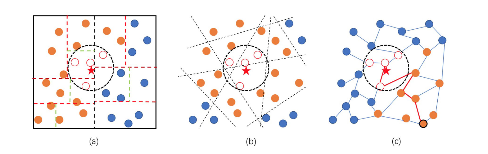
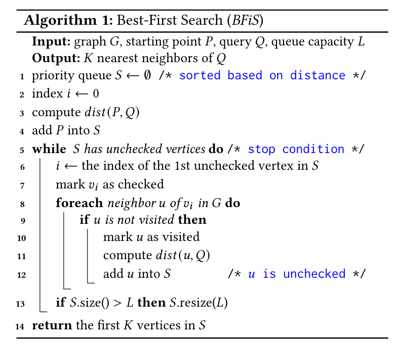
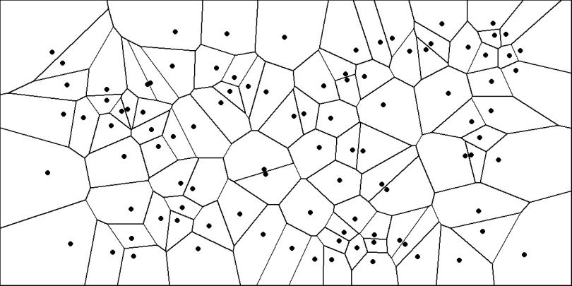
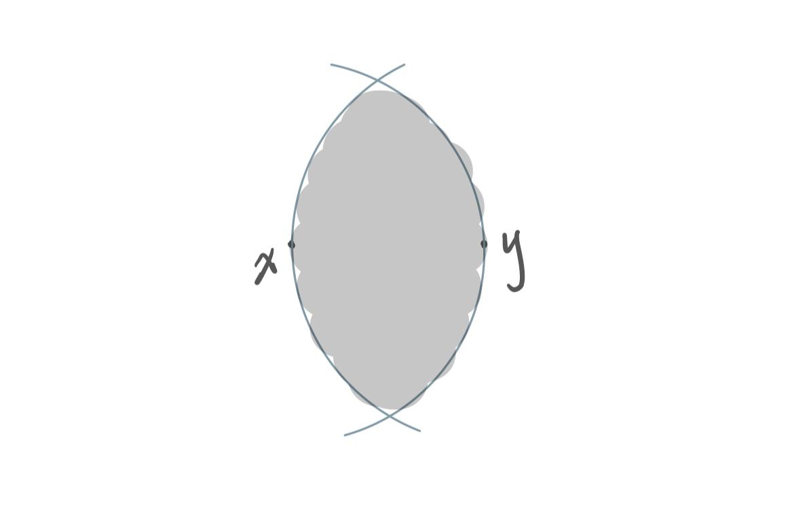
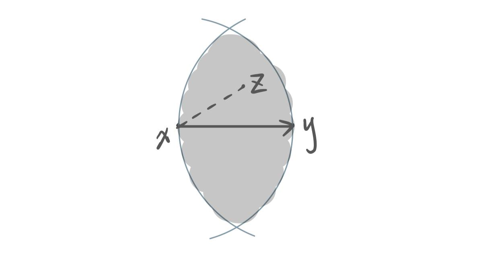
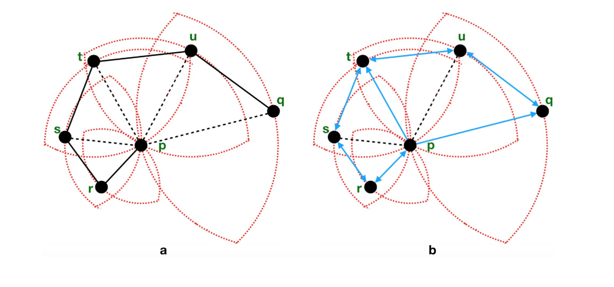
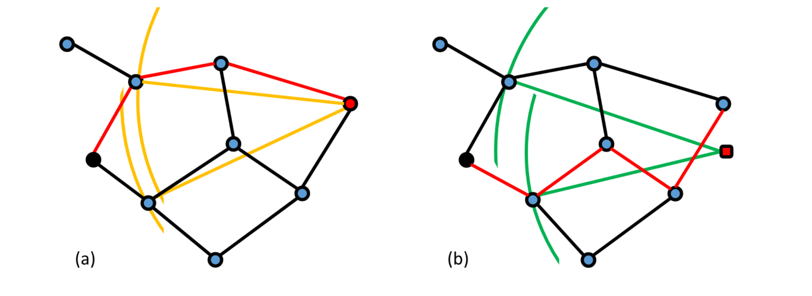
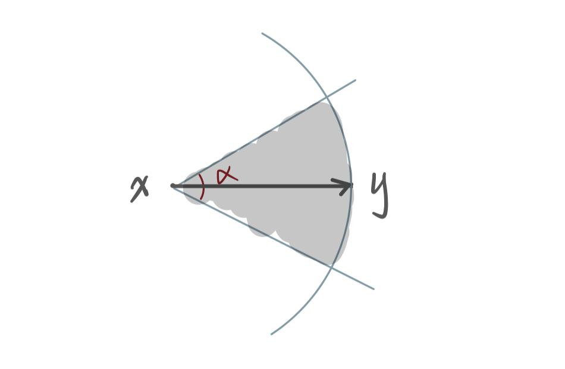

# 介绍

## 向量搜索

随着深度学习模型的广泛应用，非结构化的实体（文字、图片、语音、生物结构等等）常常被嵌入到维度为 d 的向量空间中，向量间的距离可以表示实体间的相似程度。因此，向量搜索（从已有的数据中搜索与某特定实体最相近的 K 个实体）在搜索、推荐等场景中具有广泛的应用前景。

{: .box-note}
**Problem Definition**\\
Given the query vector $\vec{x} \in \mathbb{R}^d$ and the collection $V = \{\vec{v_1}, ..., \vec{v_N}\} \subset \mathbb{R}^d$, search $K-argmin_{i=0:N} \delta(\vec{x}, \vec{v_i})$.

近似地搜索距离 query 最近的 K 个向量，搜索结果用准确率衡量。

## 现有索引介绍

向量索引的存在使得只用将 N 个向量的子集一一与 query $\vec{x}$ 进行距离计算，而获得不错的准确率。

现有的向量搜索索引包括：

- Graph-based：使用 proximity graph 从若干个 entry points 开始搜索。
- Quantization-based & hash-based：quantization 和 location sensitive hashing 本质上都是将向量从原本空间映射到更低维度空间的手段，以达到节省内存空间、提高距离计算速度等目的，这两种方法常常与聚类等一起使用。
- Tree-based：类似 KD-tree，在高维度的搜索场景下这种方法已经不常使用。

 

## Proximity Graph & BFiS

图索引使用的图统称为 Proximity Graph，每个点代表一个集合 $V$ 中的向量，点之间的边代表两点相对邻近的关系。

{: .box-note}
**Proximity Graph**: A directed graph $G = (V, E)$, where each vertex $v_i \in V$ corresponds to one of the vectors $\vec{v_i}$ in a set of $N$ $d$-dimensional embedding vectors $\{ \vec{v_1}, ..., \vec{v_N} \} \subset \mathbb{R}^d$.\\
$(v_i, v_j) \in E \Leftrightarrow v_j$ belongs to the set of *relatively* nearest neighbors of $v_i$.

在这类图中使用 BFiS 算法进行搜索。

BFiS 算法定义了两种点的状态：

- Visited：该点与 query $\vec{x}$ 进行过距离计算。
- Checked：该点与其所有出边指向的点均为 visited。

搜索过程中，维护一个长为 L 的优先级队列，其中包括当前 visited 的点集中与 query 距离最近的 L 个点。算法在优先级队列中所有点均为 checked 时结束，L 往往用来控制搜索精度。

算法细节：

# 理论上的图

这类图因为建图复杂度高、搜索效率低等原因，并不真正应用在向量搜索中，但是真实使用的图索引往往是它们的近似图。

## Delauney Triangulation

对于空间中的 N 个点，任意两点间作垂直平分线，这样可以将空间划分为若干凸多边形 (cell) 构成的分割，这样的图被称为 Voronoi Diagram。因此，相邻的 cell 间才存在边。

{: .box-note}
**Voronoi Diagram**\\
Suppose you have *n* points scattered on a plane, the Voronoi diagram of those points subdivides the plane in exactly *n* cells enclosing the portion of the plane that is the closest to each point. This produces a tessellation that completely covers the plane. In the illustration below, I plotted 100 random points and their corresponding Voronoi diagram. As you can see, every point is enclosed in a cell, whose boundaries are equidistant between two or more points. In other words, the area enclosed in the cell is closer to the point in the cell than to any other point.

而以一个点为最近点的点集就构成了它所在的凸多边形。将两个中间存在边的点相连，空间则被划分为若干三角形，这样就得到了 Voronoi Diagram 的对偶图，这样的分割称为 Delauney 三角划分。因此 DT (Delauney Triangulation) 中的边则表示了两个 cell 间的临近关系。

在维度大于 3 时，DT 的边数也逐渐爆炸，接近一张完全图，并不能应用在向量搜索中。

## Relative Neighborhood Graph (RNG)

RNG 是 DT 的生成子图。

{: .box-note}
**Relative Neighborhood Graph**\\
$$
G(V,\, E):\;(x, y) \in E \Leftrightarrow \nexists \; z \; \text{s.t.} \delta(x, z) \lt \delta(x, y) \wedge \delta(y, z) \lt \delta(x, y)
$$
即 RNG 中两点 xy 间存在边当且仅当灰色区域中不存在别的点。

一种理解是 RNG 裁掉了 DT 中钝角三角形中的长边、只留下两条短边。这样在不破坏点之间 relative-near 的关系的前提下，降低了图的稠密程度。

## Euclidean Minimal Spanning Tree (EMST)

以两点间欧氏距离为边权的最小生成树。也是 RNG 的最小的连通的子图。

## Nearest Neighbor Graph (NNG)

顾名思义，NNG 是一种有向图，每个点仅有一条出边，指向距离自己最近的邻居。 
$$
G(V,\, E):\;\forall \:0 \leq i, j \lt N, (v_i, v_j) \in E \Leftrightarrow v_j \;is \;v_i's \;NN
$$

## 总结

{: .box-note}
NNG $\subset$ EMST $\subset$ RNG $\subset$ DT（非欧氏空间中：NNG $\subset$ RNG $\subset$ DT）

# 实际使用的图索引

大致的发展历程：

// TODO 图之间的关系

## KNN

每个点有 K 条出边，指向 K 个最近邻。KNN 是 DT 的近似图（边表示了“最近”的距离关系）。

KNN 的问题：由于 KNN 上的边均为短边，导致图的直径（任意两点间的最大跳数）过大，不具有 small world property。在搜索过程中，往往从起点到 query 邻域需要很多跳（随着图的规模线性增长），影响搜索性能。

一些工作利用 KD-Tree, Hashing 等方法先定位到一个距离 query 较近的起点，但是这类方法扩展性有限。

## NSW: Navigable Small World

NSW 修改了 KNN 的构建算法，在边集中增加长边，使得图具有 small world property。

算法：增量向图中插入节点。每加入一个新的节点 v，在**当前已插入的节点中**找出距新插入点的 K 近邻，将 v与这 K 个点相连（无向图）。这样，早加入的节点便成为了热点节点，且有很多长边与其相连，从这些点开始搜索。

## HNSW: Hierarchical NSW

HNSW 是层次化的 NSW，模仿跳表的结构，上一层的节点是下一层的节点的子集。在每一层都在这些点中建一张 NSW 图。假设总共有 N 层，在 1 至 N-1 层进行 1-NN 搜索，每次达到局部最优时则进入下一层，以在上一层搜到的最近邻为起点；在第 N 层进行 K-NN 搜索。

## NSG: Navigating Spreading-out Graph

NSG 提出了一种叫做 MRNG 的图，它适当放宽了 RNG 的裁边策略。即边 $$\vec{xy}$$ 存在当且仅当灰色区域没有点、或者对于灰色区域的每个点 z 均有 $$\vec{xz} \notin E$$。

MRNG 具有 RNG 不具有的性质，它保证任意两点间存在 monotonic path，即沿着这条路径与目标节点的距离单调递减，这样可以保证搜索算法不会有 backtracking 的过程（陷入错误的局部最优）。这一性质保证了对于 in-DB query 进行 1-NN 搜索的正确性，以及搜索过程中 search sphere 的半径是单调递减的。（如下图，RNG 中从 p 到 q 不存在 monotonic path。）

NSG 是 MRNG 的近似图，保证 entry point 到每个点都存在 monotonic path。（entry point 是全局质心的最近邻）

## SSG: Satellite System Graph

SSG 注意到 NSG 的裁边策略较为激进，较少的出边会导致在某些情况下会选择较长的搜索路径，且对 not-in-DB query 没有 monotonic path 的理论支持。

因此 SSG 在建图时还考虑了角度因素，$\alpha$ 使用者设定的角度，下图中 $$\vec{xy} \in E$$ 当且仅当灰色区域中没有点、或者对于灰色区域中的每个点 z 均有 $$\vec{xz} \notin E$$。因此 SSG 又放宽了 NSG 的裁边策略，从在两个球面形成的 lune 中进行裁边改为在一个类似锥体（底面是球面）的空间中裁边。

## Vamana

Vamana 是 DiskANN 提出的图索引，类似 NSG，加入了一个可调的参数 alpha 放宽了裁边策略。

## 总结

{: box-note}

整体的发展路线呈现出裁掉了“不必要的”短边而换为相对长的边，减少了两点之间的跳数。

所谓不必要（我的理解）：邻居的邻居也是较近的点是 proximity graph 用于 ANN 搜索的基础，但是邻居的选择呈现太强的 locality（例如一跳邻居和二跳邻居的重合率较大）会导致每一步搜索带来的信息增益很小。

# Reference

1. https://en.wikipedia.org/wiki/Delaunay_triangulation
2. https://builtin.com/data-science/voronoi-diagram
3. https://en.wikipedia.org/wiki/Relative_neighborhood_graph
4. Computational Geometry: Algorithms and Applications (third version)
5. [efanna paper](http://arxiv.org/abs/1609.07228)
6. [NSW paper](https://linkinghub.elsevier.com/retrieve/pii/S0306437913001300)
7. [HNSW paper](https://arxiv.org/abs/1603.09320)
8. [NSG paper](https://arxiv.org/abs/1707.00143)
9. [SSG paper](http://arxiv.org/abs/1907.06146)
10. [SSG 知乎文章](https://zhuanlan.zhihu.com/p/100716181)
